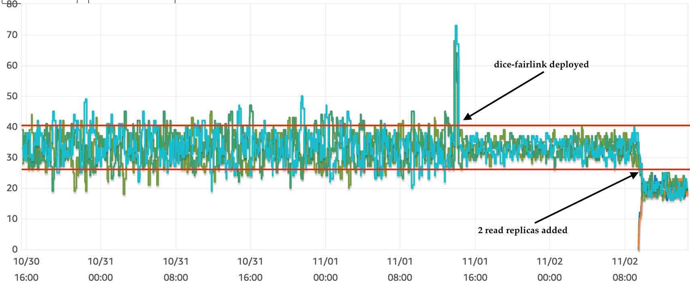

[](https://travis-ci.com/DiceTechnology/dice-fairlink)[  ](https://bintray.com/dicetechnology/dice-fairlink/dice-fairlink/_latestVersion)[](https://codecov.io/gh/DiceTechnology/dice-fairlink)

dice-fairlink is a JDBC driver designed to connect to the read replicas of an AWS Aurora cluster.
The driver will periodically obtain a description of the cluster and despatch connections to each read replica
on a round-robin fashion.

dice-fairlink does **not** handle read/write connections

# Why do we need dice-fairlink (TL/DR version)?
Because in many cases Aurora will not evenly distribute the connections amongst all the available read replicas.


# How can I use dice-fairlink (TL/DR version)?
- Add dice-fairlink as a dependency to your JVM project
- Add software.amazon.awssdk:rds and software.amazon.awssdk:resourcegroupstaggingapi as dependencies of your project
- Add `fairlink` as a jdbc sub-protocol to your connection string's schema
- If using the AWS API discovery mode, change your connection string's host to the name of your AWS Aurora cluster. Use the cluster's read-only endpoint otherwise
- Ensure the code running dice-fairlink as the correct IAM policies (see sections Member Discovery and Exclusion Discovery)

# Here for version 1.x.x ?
Version 2.x.x of dice-fairlink is substantially different internally, in particular in terms of configuration and the IAM permissions it needs to run. Please see the README.md of versions 1.x.x [here](https://github.com/DiceTechnology/dice-fairlink/blob/1.2.4/README.md).

Changes from 2.x.x:
- Added SQL discovery for postgres

Changes from 1.x.x:
- Renamed the sub-protocol from `auroraro` to `fairlink` (`auroraro` is still accepted for backward compatibility and will be removed in version 3.0.0)
- Added SQL discovery (only for MySQL. Other underlaying drivers can still use the AWS API)
- Added a randomised poller start delay to avoid swarming the AWS API if many applications using dice fairlink are started at the same time
- Refactored to make it more testable
- Reified multiple concepts (connection string, configuration, member and exclusion discoverers)
- Added the option to validate connections at the point they are discovered and before they are returned (enabled by default)
- Made dice-fairlink's dependencies of the type `provided`
- Upgraded the AWS API to version 2

# Usage Examples

dice-fairlink implements a generic sub-protocol of any existing jdbc protocol (psql,mysql,etc). For AWS API discovery (see below) the host section of the URL should be the cluster identifier and not the hostname of any cluster or instance endpoint.

The driver will accept urls in the form `jdbc:fairlink:XXXX` and delegate the actual handling of the connection to the driver of the protocol `XXXX` (which needs to be loadable by the JVM classloader).

## Example with AWS API discovery:

In a cluster named `my-cluster` with three read replicas `my-cluster-r1`, `my-cluster-r2` and, `my-cluster-r3`, and
the following connection string
```java
String connectionString = "jdbc:fairlink:mysql://my-cluster/my-schema";
```
dice-fairlink will return `my-cluster-r1` for the first connection request, `my-cluster-r2` to the second
and, `my-cluster-r3` to the third. The forth request for a connection will again return `my-cluster-r1`, and so forth.

A connection test is performed before the replica is returned to the application. This is controlled by the `validateConnection` property (see Driver Properties section).

In this example dice-fairlink will use the available mysql driver to establish the connection to the read replica.

### Driver properties:
```
discoveryMode=AWS_API
replicaEndpointTemplate=%s.-xxxxx.a-region.amazonaws.com
auroraClusterRegion=a-region
```

Dynamic changes to the cluster (node promotions, removals and additions) are automatically detected.

## Example with MySQL discovery:

In a cluster named `my-cluster` with three read replicas `my-cluster-r1`, `my-cluster-r2` and, `my-cluster-r3`, and
the following connection string
```java
String connectionString = "jdbc:fairlink:mysql://my-cluster.cluster-xxxxx.a-region.amazonaws.com/my-schema";
```
dice-fairlink will return `my-cluster-r1` for the first connection request, `my-cluster-r2` to the second
and, `my-cluster-r3` to the third. The forth request for a connection will again return `my-cluster-r1`, and so forth.

A connection test is performed before the replica is returned to the application. This is controlled by the `validateConnection` property (see Driver Properties section).

### Driver properties:
```
discoveryMode=SQL_MYSQL
replicaEndpointTemplate=%s.-xxxxx.a-region.amazonaws.com
fallbackEndpoint=my-cluster.cluster-ro--xxxxx.region.amazonaws.com
auroraClusterRegion=a-region
```

In this example dice-fairlink will use the available mysql driver to establish the connection to the read replica.

Dynamic changes to the cluster (node promotions, removals and additions) are automatically detected.

## Example with Postgres discovery:

In a cluster named `my-cluster` with three read replicas `my-cluster-r1`, `my-cluster-r2` and, `my-cluster-r3`, and
the following connection string
```java
String connectionString = "jdbc:fairlink:postgresql://my-cluster.cluster-xxxxx.a-region.amazonaws.com/my-schema";
```
dice-fairlink will return `my-cluster-r1` for the first connection request, `my-cluster-r2` to the second
and, `my-cluster-r3` to the third. The forth request for a connection will again return `my-cluster-r1`, and so forth.

A connection test is performed before the replica is returned to the application. This is controlled by the `validateConnection` property (see Driver Properties section).

### Driver properties:
```
discoveryMode=SQL_POSTGRES
replicaEndpointTemplate=%s.-xxxxx.a-region.amazonaws.com
fallbackEndpoint=my-cluster.cluster-ro--xxxxx.region.amazonaws.com
auroraClusterRegion=a-region
```

In this example dice-fairlink will use the available mysql driver to establish the connection to the read replica.

Dynamic changes to the cluster (node promotions, removals and additions) are automatically detected.


# Member discovery
dice-fairlink offers two options to discover the members of an Aurora cluster. It polls for any changes and update its internal state with the configured frequency (see Driver Properties section). The driver does this once when the driver is loaded, and enters the periodic poll cycle This after a random delay of up to 10 seconds. This is to avoid, in scenarios of large clusters of applications using dice-fairlink, exceeding the rate limits imposed by AWS. 

Versions 1.x.x of dice-fairlink are very prone to this problem, as they make 1+2*number_of_replicas (`O(n)`) calls on each cycle. Versions 2.x.x make 2 (`O(1)`) calls per cycle when using `AWS API` discovery mode, and 0 calls per cycle when using `MySQL` mode. See the Exclusions section to learn about an additional call on both discovery modes.

## AWS API Mode
dice-fairlink uses the [`RDS` API](https://docs.aws.amazon.com/AmazonRDS/latest/APIReference/Welcome.html) to discover the members of a cluster, and to determine which cluster member is the writer. To use this discovery mode, the code must be executed by an IAM user with the following policy:
```json
[
   {
      "Effect":"Allow",
      "Action":[
         "rds:DescribeDBClusters"
      ],
      "Resource":[
         "arn:aws:rds:*:<account_id>:cluster:<cluster_name_regex>"
      ]
   },
    {
      "Effect":"Allow",
      "Action":[
         "rds:DescribeDBInstances",
         "rds:ListTagsForResource"
      ],
      "Resource":"*"
    }
]
``` 

Note that the regex above can be merely `*` depending on how strict you want your permissions to be.


When using the `AWS API` discovery mode, the `host` part of the connection string must be the **cluster identifier**. For example, for a cluster with the cluster endpoint `abc.cluster-xxxxxx.eu-west-1.rds.amazonaws.com`, it must be set to `abc`. The cluster's read-only endpoint will be used as 
fallback should an error occur in refreshing the list of cluster members, unless the device property `fallbackEndpoint` is set (not recommended to be set to a specific replica).
On this discovery mode, dice-fairlink will additionally check if all the replicas are in the `AVAILABLE` state. This is because, during a DB Instance deletion, RDS will remove the tags *before* removing
it from the list of cluster members. This can cause a period where the exclusion tag is no longer present, but the server is deleted shortly after, causing connections to be dropped, causing application errors.

If your cluster uses the `MySQL` engine, it is recommended to use the `MySQL` discovery mode, as it is gentler on the AWS API.


## SQL-based discovery modes
dice-fairlink can connect to the aurora database and use specific queries AWS provides to obtain the list of cluster members. 

A SQL-based discovery mode does not require any special IAM user permissions. 

When using the a sql discovery mode, the `host` part of the connection string must be a **cluster endpoint**. 
We recommend using the cluster (writer) endpoint as the hostname of all fairlink's connection strings.

To avoid burdening the writer node with read-only statements in the event of a failure, set the `fallbackEndpoint` driver property (see Driver Properties section). 

## MySQL Mode
dice-fairlink uses the `information_schema.replica_host_status` table available on Aurora MySQL clusters to list the members of a given cluster. The credentials on the connection string, or on the driver properties will be used.

When using the `MySQL` discovery mode, the `host` part of the connection string must be a **cluster endpoint**. Even though [AWS's documentation](https://d1.awsstatic.com/whitepapers/RDS/amazon-aurora-connection-management-handbook.pdf) states either the writer or reader endpoint will work - in fact that *any instance* would work - 
we have observed situations where querying any instance other than the writer will return a **partial list of cluster members**, which will limit the effectiveness of dice-fairlink. 
For this reason, we recommend using the cluster (writer) endpoint as the hostname of all fairlink's connection strings. To avoid burdening the writer node with read-only statements in the event of a failure, 
set the `fallbackEndpoint` driver property (see Driver Properties section). 

For example, for a cluster with the cluster endpoint `abc.cluster-xxxxxx.eu-west-1.rds.amazonaws.com`, it must be set to `abc.cluster-xxxxxx.eu-west-1.rds.amazonaws.com`. This host will be used as a fallback in the case clusters without any replicas or if an error occurs, unless the variable `fallbackEndpoint` is set to the cluster's read endpoint (recommended).

## Postgres Mode
dice-fairlink uses the `aurora_replication_status()` function available on Aurora Postgres clusters to list the members of a given cluster. The credentials on the connection string, or on the driver properties will be used.

## Connection validation
dice-fairlink validates every replica before making it available to the application. This is done once on every discovery cycle. On versions 1.x.x dice-fairlink would rely on the `RDS`API returning instances in the `available` status. On versions 2.x.x dice-fairlink executes `SELECT 1` on each discovered replica, using the underlaying protocol, as specified on the connection string. This validation occurs regardless of the discovery mode, and be disabled via the `validateConnection` property (see Driver Properties section)

# Exclusions discovery
It is possible to prevent members of an Aurora cluster to receive connections despatched by dice-fairlink. This is particularly useful when scaling in a cluster, as it allows the connections to a particular node to drain prior to deletion, and thus avoiding application errors. 

To exclude a member, tag it with key=`Fairlink-Exclude` and value=`true`. dice-fairlink
will treat them as not available and skip them when assigning connections. Tag changes will be picked up within the time specified in `tagsPollInterval` (see Driver Properties section). Please note that versions 1.x.x would poll for this information with a frequency determined by `replicaPollInterval` instead.

dice-fairlink uses the [`Resource Group` API](https://docs.aws.amazon.com/ARG/latest/APIReference/Welcome.html) to obtain the list of all excluded members. Unfortunately this API does not offer a way to obtain only the information pertaining to a specific cluster, and as a consequence dice-fairlink will hold information about **all** RDS instances tagged with `Fairlink-Exclude=true` in the entire region of the AWS account in question. It is also not possible to restrict this via an IAM policy. It is assumed the size of this collection will not be problematic, and that making a single call (instead of 1 call per database instance) outweighs this waste. 

For the discovery of exclusions (not possible to switch off in the current version) to work correctly, the code must be executed by an IAM user with the following policy:

```json
[
   {
      "Effect":"Allow",
      "Action":[
         "tag:GetResources",
         "tag:GetTagValues",
         "tag:GetTagKeys"
      ],
      "Resource":"*"
   }
]
```

# Why do we need dice-fairlink (long version)?
Using AWS Aurora clusters with database connection pools is a common use case. A possible configuration is to point
a connection pool to the cluster's read-only endpoint. AWS claims ([here](https://aws.amazon.com/blogs/aws/new-reader-endpoint-for-amazon-aurora-load-balancing-higher-availability/),
[here](https://docs.aws.amazon.com/AmazonRDS/latest/AuroraUserGuide/Aurora.Overview.Endpoints.html), and
[here](https://docs.aws.amazon.com/AmazonRDS/latest/AuroraUserGuide/CHAP_Aurora.html#Aurora.Overview.Endpoints))
that Aurora will send the new connections to different read replicas in a quasi-round-robin fashion. It is well documented on
the references above that Aurora does this based on the number of connections each of the replicas is holding at the time of receiving a new connection request. This is done via DNS, with a 1 second TTL. This means that, for a period of 1
second, all new connection requests will be sent to the same read replica.

**Example**:
Consider an Aurora cluster with the read endpoint at `read-endpoint-url`, and read replicas `r1`, `r2`, `r3`, and `r4`.
Also consider an application using a fixed-sized connection pool of 10 connections, recycled every 30 minutes. Finally,
consider we have a cluster of 3 servers running this application. When we launch the servers for the first time, the
following is a possible timeline (times in ms), starting from an idle cluster:
- **t0**: Server 1 comes online and pre-fills the connection pool, sending 10 connection requests to `read-endpoint-url`
- **t0**: Aurora directs 10 connections to `r1`
- **t500**: Server 2 comes online and pre-fills the connection pool, sending 10 connection requests to `read-endpoint-url`
- **t750**: Aurora directs 10 connections to `r1`
- **t1500**: Server 3 comes online and pre-fills the connection pool, sending 10 connection requests to `read-endpoint-url`
- **t1500**: Aurora directs 10 connections to `r2`

The ideal scenario would be 10 connection on each read-replica. Unfortunately, as Server 1 and Server 2 populated their connection pools with less than 1 seconds' difference, and Aurora has cached the name resolution of `read-endpoint-url` to `r1`for 1 second starting on **t0**, Server 2's requests will also be sent to `r1`. `r1` ends up serving 20 connections, `r2` 10 connections and `r3` will be idle.

The fact Aurora's uses DNS to distribute the connections amongst the available read replicas can also be problematic due to other components of a solution. If any network agent (local server, router, etc) caches DNS resolutions, the results will become harder to predict. On top of this, Java can also cache DNS resolutions. It does so by default **forever**, or for 30 seconds depending on the JVM version and vendor.

## What other options did we try before writing dice-fairlink ?
We tried the following, commutative, options

### Controlling DNS
In a controlled environment we disabled Java DNS cache (see [here](https://docs.aws.amazon.com/sdk-for-java/v1/developer-guide/java-dg-jvm-ttl.html),
or [here](https://docs.oracle.com/javase/7/docs/technotes/guides/net/properties.html)) and any other intermediate caches between the server
and the Aurora cluster.

**result**: this allowed us to achieve the results described on the previous section.

### Tweaking pool parameters
We configured our connection pool to not be fixed-sized and to have a much lower connection maximum lifetime (2 minutes). Additionally we had a random (maximum 2.5% of the maximum lifetime) variance on the maximum lifetime for each pool generation. Finally, each application server had a different maximum connection lifetime.

The rationale was to try to disperse connection requests to the Aurora cluster as much as possible.

**result**: with the non-deterministic random variables did generate better distribution in some occasions. However, the random nature of this experiment also means that, in other occasions, a single read replica received all 30 connections. It is not simple to reliably set all the variables mentioned above in such a way that each server will request a connection to Aurora if and only if no other server has requested a connection in the previous second.

## How does dice-fairlink solve this problem ?
dice-fairlink does not require using the Aurora cluster read only endpoint. Instead, it keeps a list of addresses for every read replica of a given cluster. When the client application (through a connection pool or otherwise) requests a connection to the jdbc driver, dice-fairlink selects the next read replica and delegates the
actual establishing of the connection to the underlying jdbc driver (see usage examples). The frequency with which this list is refreshed is configurable (see driver parameters).

In the current version, dice-fairlink does not dynamically mark replicas as faulty, or try to despatch connections taking into account how busy each replica is. It simply returns the read replica that hasn't been returned for longer(round-robin).

# Installation

Add the following repository to your `~/.m2/settings.xml` file or to your `pom.xml` file.
```xml
<repository>
    <snapshots>
	<enabled>false</enabled>
    </snapshots>
    <id>bintray-dicetechnology-dice-fairlink</id>
    <name>bintray</name>
    <url>https://dl.bintray.com/dicetechnology/dice-fairlink</url>
</repository>
```

Add the following dependency to your `pom.xml`
```xml
<dependency>
   <groupId>technology.dice.open</groupId>
   <artifactId>dice-fairlink</artifactId>
   <version>x.y.z</version>
</dependency>
```

dice-fairlink's dependencies are not transitive, and depends only on three `provided` artifacts. The application using dice-fairlink must include the following dependencies:

```xml
<dependency>
	<groupId>software.amazon.awssdk</groupId>
	<artifactId>rds</artifactId>
	<version>2.7.23</version>
</dependency>
	<dependency>
	<groupId>software.amazon.awssdk</groupId>
	<artifactId>resourcegroupstaggingapi</artifactId>
	<version>2.7.23</version>
</dependency>
```

Any version compatible with `2.7.23` will work.

Additionally, the jdbc driver for the underlaying protocol must be available at runtime (usually loaded via SPI).


# Driver properties
dice-fairlink uses the AWS RDS Java SDK to obtain information about the cluster, and needs a valid authentication
source to establish the connection. Two modes of authentication are supported: `default_chain`, `environment` or `basic`. Depending
on the chosen mode, different driver properties are required. This is the full list of properties:
- `replicaEndpointTemplate`: the `String.format()` template to generate the replica hostnames, given their `DBInstanceIdentifier`s. The resulting URI (which will maintain all the connetion string's non-hostname parts) is where dice-fairlink will send connections to. Mandatory.
- `fallbackEndpoint`: the fallback URI to despatch if no replicas are found or if an error occurs. default: the `host` specified in the connection string.
- `discoveryMode`: `{'AWS_API'|'SQL_MYSQL}`. default: `AWS_API`
- `auroraClusterRegion`: the AWS region of the cluster to connect to. Mandatory unless environment variable `AWS_DEFAULT_REGION` is set. If both provided,
the value from data source properties object has priority.
- `auroraDiscoveryAuthMode`: `{'default_chain'|'environment'|'basic'}`. default: `default_chain`
- `auroraDiscoveryKeyId`: the AWS key id to connect to the Aurora cluster. Mandatory if the authentication mode is `basic`.
Ignored otherwise.
- `auroraDiscoverKeySecret`: the AWS key secret to connect to the Aurora cluster. Mandatory if the authentication mode is `basic`.
Ignored otherwise.
- `replicaPollInterval`: the interval, in seconds, between each refresh of the list of read replicas. default: `30`
- `tagsPollInterval`: the interval, in seconds, between each refresh of the list of excluded replicas. default: `120`
- `validateConnection`: `{'true'|'false}`. default: `true`

all properties (including the list above) will be passed to the underlying driver.

# Discovery authentication modes
In order to discover the members of a given cluster, dice-fairlink makes use of the AWS RDS SDK. This means the client application must provide some means 
of authentication for dice-fairlink to execute the necessary API methods. See section Member Discovery for further information.

- default_chain mode: will use the AWS library default provider chain. This is, as of version `1.11.251`, the following order: environment, system properties,
user profile, EC2 container credentials
- environment: reads the key and secret from  `AWS_ACCESS_KEY_ID`/`AWS_ACCESS_KEY` and `AWS_SECRET_KEY`/`AWS_SECRET_ACCESS_KEY` variables
- basic: takes the credentials from two driver properties as defined above


# Logging
To limit the dependencies of dice-fairlink, the `java.util.logging` package is used for logging.
Client applications may make use of the popular `slf4j` library, in which case the following block of
bootstrap code is necessary to connect the two logging systems:
```java
    SLF4JBridgeHandler.removeHandlersForRootLogger();
    SLF4JBridgeHandler.install();
```
additionally, the following dependency must be added to the project:
```xml
<dependency>
    <groupId>org.slf4j</groupId>
    <artifactId>jul-to-slf4j</artifactId>
    <version>x.y.z</version>
</dependency>
```
This will direct the `java.util.logging` logging statements to SLF4J, and make them available to any
logging backend as `logback` or `log4j`.
